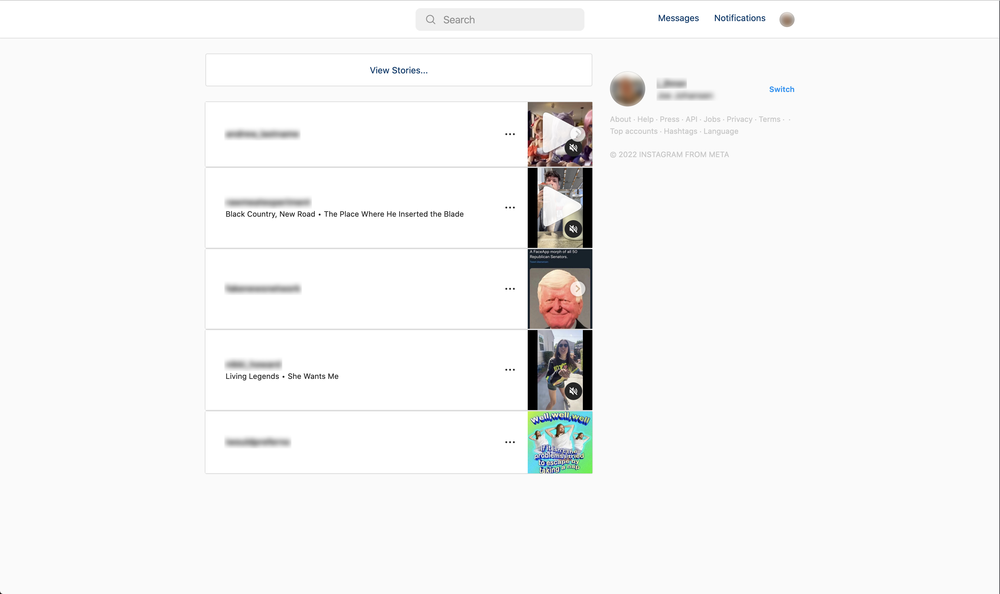
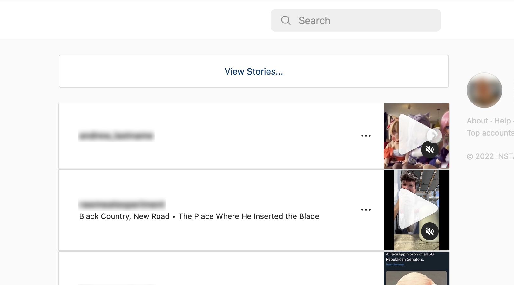
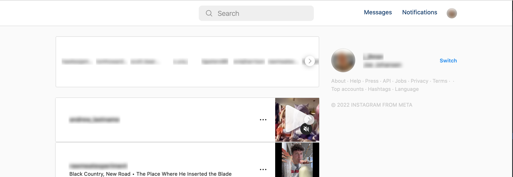

# Boringstagram

## About

As the name suggests, Boringstagram is a browser extension designed to make instagram more boring. It aims to make the interface and experience deliberately less engaging, so that users are inclined to spend less time using it, or are less likely to develop addictions - all round better for your mental health and productivity.

Best of all, it does not compromise on functionality, so you can still stay up to date with everything your friends are doing!

## Features

#### Blurring is for demonstration only

- Posts in the feed are collapsed by default, to make it deliberately less immersive and also
  quicker to browse

The default feed view

Roll over a post (or touch it on a touch screen) to view it

- Stories are hidden from the top of the feed by default
  - Hover over the top box (or touch it on a touch screen) to show them
- Profile pictures are also hidden from stories
  - Blurring is for demonstration only

- The explore page is disabled by default. Never get distracted when you are trying to search for
  something ever again
- Lightweight and secure by default. This extension is curently css-only and does not read any
  specific content on the page, so you personal information is secure.

## Future ideas

- Option to hide all reels
- If you do watch a reel, having an option to disable scrolling down to the next one
- Automatically closing stories when you get the end of a person's story (instead of being endlessly
  taken to the next one)

## Installation

Download it from its respective store:

#### Chrome

[https://chrome.google.com/webstore/detail/boringstagram/doonmkfhjfabfaomehkcgoigghjnonmk](https://chrome.google.com/webstore/detail/boringstagram/doonmkfhjfabfaomehkcgoigghjnonmk)

#### Firefox

[https://addons.mozilla.org/en-GB/firefox/addon/boringstagram/](https://addons.mozilla.org/en-GB/firefox/addon/boringstagram/)

#### Safari

Coming soon, possibly...

## Logo attribution

Courtesy of [OpenMoji](https://openmoji.org/) – the open-source emoji and icon project. License: CC BY-SA 4.0
